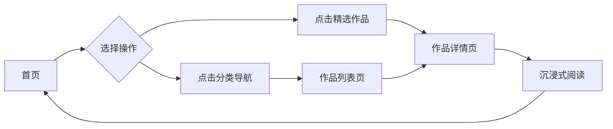

# 文学作品展示网站 - 产品需求文档 (PRD)

## 1. 产品概述
一个优雅的个人文学作品展示平台，专为文学创作者打造。提供诗歌、散文、小说三大板块的展示空间，支持灵活的内容管理和沉浸式阅读体验。

**目标用户**：文学爱好者、作家、诗人、需要展示原创作品的创作者
**核心价值**：以精致的视觉呈现提升作品的艺术感染力，让文字与美学完美融合

## 2. 核心功能

### 2.1 用户角色
| 角色 | 访问方式 | 核心权限 |
|------|----------|----------|
| 访客 | 直接访问 | 浏览所有作品、切换分类、阅读全文 |
| 作者（您） | 本地编辑 | 通过修改数据文件自由添加/编辑内容 |

### 2.2 功能模块
1. **首页**：品牌展示区、作品分类导航、精选作品预览
2. **作品列表页**：按分类（诗歌/散文/小说）筛选展示、作品卡片网格
3. **作品详情页**：完整作品内容、沉浸式阅读体验、返回导航

### 2.3 页面详情
| 页面名称 | 模块名称 | 功能描述 |
|---------|----------|----------|
| 首页 | Hero区域 | 大标题展示、作者署名、背景氛围营造 |
| 首页 | 分类导航 | 三个板块入口卡片（诗歌/散文/小说） |
| 首页 | 精选推荐 | 最新或推荐的3篇作品预览 |
| 作品列表页 | 筛选栏 | 分类标签切换、作品数量统计 |
| 作品列表页 | 作品网格 | 响应式卡片布局、标题+摘要+标签 |
| 作品详情页 | 内容区 | 完整正文、排版优化、阅读进度 |
| 作品详情页 | 元信息 | 创作日期、字数统计、分类标签 |

## 3. 核心流程

### 用户浏览流程
```
访客进入首页 → 浏览Hero区域和精选作品 → 点击分类或具体作品 → 进入作品列表/详情 → 沉浸式阅读 → 返回继续探索
```



### 内容管理流程
```
作者编辑数据文件 → 更新作品信息 → 刷新页面查看效果 → 迭代优化
```

## 4. 用户界面设计

### 4.1 设计风格
**整体定位**：新中式文人美学 + 现代极简主义

- **主色调**：
  - 背景：暖象牙白 `#FAF8F5`
  - 主文字：深墨色 `#2C2C2C`
  - 强调色：朱砂红 `#B54434`（用于重要元素）
  - 辅助色：古铜金 `#A68A56`（装饰线条、图标）
  - 卡片背景：米白色 `#FFFFFF` 配微阴影

- **按钮样式**：
  - 主要按钮：细边框 + 朱砂红文字 + 悬停填充动画
  - 次要按钮：纯文字链接样式，下划线悬停效果
  - 圆角：轻微圆角 `4px`

- **字体方案**：
  - 标题字体：`Playfair Display` 或 `Noto Serif SC`（衬线体，优雅）
  - 正文字体：`LXGW WenKai`（霞鹜文楷，中文友好）或系统衬线字体
  - 英文辅助：`Cormorant Garamond`（艺术感）
  - 字号层级：标题 48px / 副标题 32px / 正文 18px / 辅助 14px

- **布局风格**：
  - 杂志式编辑布局，非对称平衡
  - 大量留白营造呼吸感
  - 卡片采用微妙阴影和边框装饰
  - 装饰元素：竖排文字、传统纹样点缀

- **图标/装饰风格**：
  - 极简线条图标
  - 中式印章风格的作者标识
  - 分隔线使用传统云纹或波浪线

### 4.2 页面设计概览
| 页面名称 | 模块名称 | UI元素 |
|---------|----------|--------|
| 首页 | Hero区域 | 全屏高度、渐变背景纹理、大标题居中、副标题、向下滚动提示动画 |
| 首页 | 分类导航 | 三列等宽卡片、每个卡片包含：图标/符号、分类名、作品数量、简短描述 |
| 首页 | 精选推荐 | 2-3个横向排列的大卡片、标题+摘要+阅读更多 |
| 作品列表页 | 顶部栏 | 页面标题、分类标签组（可切换）、排序选项 |
| 作品列表页 | 作品网格 | 响应式3列网格（桌面）、每卡包含：封面装饰、标题、摘要、日期、标签 |
| 作品详情页 | 头部区 | 返回按钮、标题、元信息（日期/分类/字数） |
| 作品详情页 | 正文区 | 居中窄栏布局（最大宽度720px）、优雅行距、首行缩进、段落间距 |
| 作品详情页 | 底部区 | 上一篇/下一篇导航、返回列表按钮 |

### 4.3 响应式策略
**桌面优先设计**（Desktop-first）
- **桌面端（≥1200px）**：完整三列布局、大尺寸卡片、丰富动效
- **平板端（768-1199px）**：两列布局、适度缩小尺寸、保留核心动效
- **移动端（<768px）**：单列堆叠、触控优化、简化动画、增大触控区域

**触控优化**：
- 按钮/链接最小点击区域 44x44px
- 卡片悬停效果改为点击反馈
- 导航菜单移动端改为汉堡菜单

### 4.4 特殊设计细节
- **页面加载**：淡入 + 微上移的组合动画，错开延迟
- **滚动体验**：平滑滚动、视差效果（可选）、滚动时元素渐显
- **阅读模式**：详情页支持调整字号大小（小/中/大三档）
- **暗色模式**：暂不实现（保持温暖明亮的阅读氛围）
- **打印友好**：详情页支持浏览器打印功能，自动优化排版

## 5. 数据结构说明

### 作品数据模型
```javascript
{
  id: "unique-id",
  title: "作品标题",
  category: "poetry" | "prose" | "fiction", // 诗歌/散文/小说
  summary: "简短摘要（100字以内）",
  content: "完整正文内容...",
  createdAt: "2026-01-01",
  wordCount: 1234,
  tags: ["标签1", "标签2"],
  isFeatured: true // 是否在首页推荐
}
```

### 数据存储方式
- 使用本地 JSON 文件存储作品数据
- 作者可直接编辑 JSON 文件添加/修改作品
- 无需数据库，无需后端服务，纯静态站点
