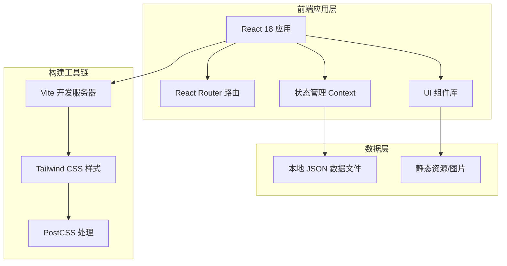

# 文学作品展示网站 - 技术架构文档

## 1. 架构设计



**架构特点**：
- 纯前端静态站点，无需后端服务
- 数据通过本地 JSON 文件管理，便于内容更新
- 组件化开发，易于维护和扩展
- 使用 Vite 提供极速的开发体验

## 2. 技术选型

### 前端技术栈
- **框架**：React 18.2+
- **构建工具**：Vite 5.x
- **样式方案**：Tailwind CSS 3.4+
- **路由管理**：React Router 6.x
- **状态管理**：React Context API（轻量级需求）
- **动画库**：Framer Motion 10.x（流畅的页面过渡和交互动画）
- **图标库**：Lucide React（轻量、优雅的线性图标）
- **字体**：Google Fonts（Noto Serif SC, Playfair Display, LXGW WenKai）

### 开发工具
- **包管理器**：npm / pnpm
- **代码规范**：ESLint + Prettier
- **版本控制**：Git（可选）

### 为什么选择这个技术栈？
1. **React**：组件化开发适合内容展示型网站，生态成熟
2. **Vite**：极快的冷启动和热更新，开发体验优秀
3. **Tailwind CSS**：实用优先的 CSS 框架，快速实现精致 UI，自定义主题方便
4. **Framer Motion**：声明式动画，轻松实现复杂的过渡效果
5. **纯静态部署**：可部署到 GitHub Pages、Vercel、Netlify 等平台，零成本托管

## 3. 项目目录结构

```
wenxue/
├── public/
│   └── images/              # 图片资源（如有）
├── src/
│   ├── assets/              # 静态资源（字体、样式文件等）
│   │   └── styles/
│   │       └── globals.css  # 全局样式 + Tailwind 自定义配置
│   ├── components/          # 可复用组件
│   │   ├── layout/
│   │   │   ├── Header.jsx       # 顶部导航栏
│   │   │   ├── Footer.jsx       # 底部信息栏
│   │   │   └── Layout.jsx       # 页面布局容器
│   │   ├── ui/
│   │   │   ├── Button.jsx       # 按钮组件
│   │   │   ├── Card.jsx         # 卡片组件
│   │   │   ├── Tag.jsx          # 标签组件
│   │   │   └── Typography.jsx   # 排版组件
│   │   └── sections/
│   │       ├── HeroSection.jsx      # 首页 Hero 区域
│   │       ├── CategoryNav.jsx      # 分类导航
│   │       ├── FeaturedWorks.jsx    # 精选作品
│   │       ├── WorkGrid.jsx         # 作品网格
│   │       ├── WorkDetail.jsx       # 作品详情
│   │       └── ReadingProgress.jsx  # 阅读进度条
│   ├── data/
│   │   └── works.json          # 作品数据文件
│   ├── pages/
│   │   ├── Home.jsx            # 首页
│   │   ├── WorksList.jsx       # 作品列表页
│   │   └── WorkDetail.jsx      # 作品详情页
│   ├── context/
│   │   └── WorksContext.jsx     # 作品数据上下文
│   ├── hooks/
│   │   └── useReadingProgress.js  # 阅读进度 Hook
│   ├── utils/
│   │   └── helpers.js          # 工具函数
│   ├── App.jsx                 # 应用根组件
│   └── main.jsx                # 入口文件
├── .trae/
│   └── documents/              # 项目文档
├── index.html                  # HTML 模板
├── package.json                # 项目依赖
├── tailwind.config.js          # Tailwind 配置
├── vite.config.js              # Vite 配置
├── postcss.config.js           # PostCSS 配置
└── README.md                   # 项目说明（可选）
```

## 4. 路由定义

| 路由路径 | 页面名称 | 功能描述 |
|---------|----------|----------|
| `/` | 首页 | Hero 区域 + 分类导航 + 精选作品 |
| `/works` | 作品列表 | 所有作品展示，支持分类筛选 |
| `/works/:category` | 分类列表 | 按类别（poetry/prose/fiction）筛选 |
| `/work/:id` | 作品详情 | 单篇作品的完整内容和阅读界面 |

**路由配置示例**：
```jsx
<Routes>
  <Route path="/" element={<Home />} />
  <Route path="/works" element={<WorksList />} />
  <Route path="/works/:category" element={<WorksList />} />
  <Route path="/work/:id" element={<WorkDetail />} />
</Routes>
```

## 5. 组件设计

### 核心组件清单

#### 布局组件
- **Layout**：统一页面结构，包含 Header 和 Footer
- **Header**：固定顶部导航，包含 Logo/站名、导航链接、主题切换（预留）
- **Footer**：版权信息、联系方式（预留）

#### UI 组件
- **Button**：多种变体（主要/次要/文字），支持不同尺寸
- **Card**：作品卡片容器，支持悬停效果
- **Tag**：分类/标签显示组件
- **Typography**：统一的标题、正文、引用等排版样式

#### 业务组件
- **HeroSection**：首页大屏展示区，包含主标题、副标题、CTA
- **CategoryNav**：三大分类入口（诗歌/散文/小说），视觉化展示
- **FeaturedWorks**：首页精选作品横向展示
- **WorkGrid**：响应式作品网格布局
- **WorkDetail**：作品详情主体，包含元信息和正文
- **ReadingProgress**：阅读进度指示器

### 组件通信方式
- **父子组件**：Props 传递
- **跨组件共享**：Context API（作品数据、当前分类等）
- **全局状态**：React Router（URL 参数、当前位置）

## 6. 数据模型

### 6.1 数据定义

**作品数据结构（works.json）**：
```json
{
  "works": [
    {
      "id": "poetry-001",
      "title": "春日偶成",
      "category": "poetry",
      "categoryLabel": "诗歌",
      "summary": "一首关于春日感悟的现代诗，描绘自然与内心的对话。",
      "content": "完整的诗歌内容...\n\n可以包含多个段落...",
      "createdAt": "2026-05-15",
      "wordCount": 256,
      "tags": ["现代诗", "自然", "感悟"],
      "isFeatured": true
    }
  ],
  "categories": {
    "poetry": {
      "name": "诗歌",
      "icon": "feather",
      "description": "韵律与意象的交织",
      "count": 0
    },
    "prose": {
      "name": "散文",
      "icon": "book-open",
      "description": "日常与哲思的随笔",
      "count": 0
    },
    "fiction": {
      "name": "小说",
      "icon": "scroll-text",
      "description": "故事与人物的编织",
      "count": 0
    }
  },
  "authorInfo": {
    "name": "您的笔名",
    "bio": "一句话介绍自己",
    "avatar": null
  }
}
```

### 6.2 示例数据

为演示目的，将提供 3-5 篇示例作品（每个分类至少 1 篇），包括：
- 诗歌：《春日偶成》、《夜思》
- 散文：《老街的记忆》、《茶香四溢》
- 小说：《雨夜来客》（短篇节选）

这些示例数据将帮助您理解数据格式，您可以随时替换为自己的真实作品。

## 7. 性能优化策略

### 代码层面
- **组件懒加载**：使用 React.lazy + Suspense 实现路由级代码分割
- **图片优化**：使用 WebP 格式，提供 lazy loading
- **Tree Shaking**：确保只打包使用的代码

### 样式层面
- **Tailwind PurgeCSS**：生产环境自动移除未使用的样式
- **CSS 内联关键路径**：首屏关键样式内联到 HTML

### 用户体验
- **骨架屏**：数据加载时显示占位符
- **预加载**：鼠标悬停预卡片时预加载详情页资源
- **缓存策略**：利用浏览器缓存静态资源

## 8. 部署方案

### 推荐平台（任选其一）
1. **Vercel**：一键部署 Git 仓库，自动 HTTPS，全球 CDN
2. **GitHub Pages**：免费托管，适合开源项目
3. **Netlify**：拖拽部署，支持表单和函数（如需后续扩展）

### 部署步骤（以 Vercel 为例）
1. 将代码推送到 GitHub/GitLab 仓库
2. 在 Vercel 导入仓库
3. 设置构建命令：`npm run build`
4. 设置输出目录：`dist`
5. 部署完成，获得公开访问 URL

## 9. 扩展性考虑

### 未来可能的功能（预留接口）
- 🔍 搜索功能：作品标题/内容全文搜索
- 🌓 暗色模式：护眼夜间阅读模式
- 💬 评论系统：读者留言互动（需后端支持）
- 👤 作者后台：在线编辑作品（需后端支持）
- 📱 PWA 支持：离线阅读能力
- 🌐 多语言：中英文切换（如需国际化）

### 当前不实现的原因
保持项目简洁，聚焦核心展示功能，避免过度工程化。
